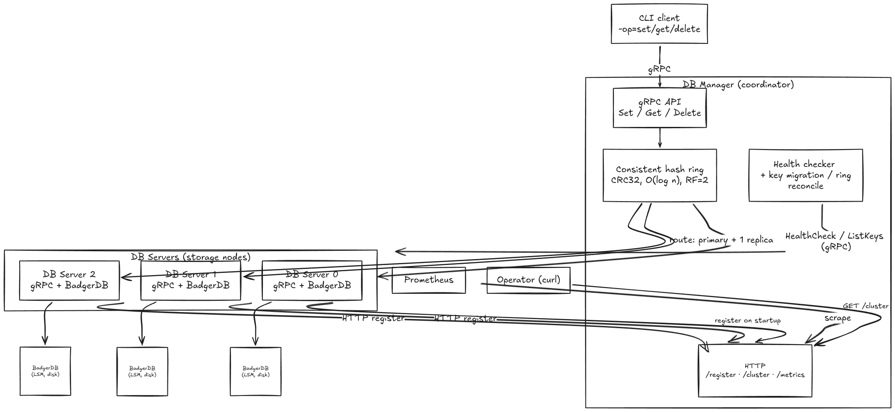
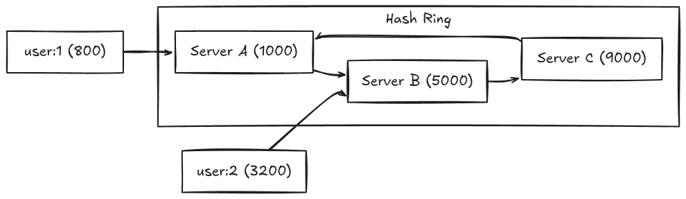

# meerkat

[](https://go.dev)

A distributed key-value database built in Go, featuring consistent hashing for data distribution, data replication for fault tolerance, automatic key migration on topology changes, and gRPC for inter-node communication.

## Architecture

- Distributed key-value store with a **coordinator / storage-node** split, organized as 6 independent Go modules (`db_manager`, `db_server`, `db`, `client`, `pb`, `utils`). All inter-node communication is **gRPC + Protocol Buffers**.
- The **DB Manager** (coordinator) owns a **CRC32 consistent-hash ring** (sorted ring, `O(log n)` binary-search lookup), routes client `Set/Get/Delete`, replicates each write **synchronously to 2 successor nodes** (replication factor 2), and on reads tries the primary then fails over to replicas.
- **DB Servers** wrap **BadgerDB** (pure-Go LSM engine) and expose a 5-method gRPC service (`Set/Get/Delete/HealthCheck/ListKeys`). Each server **self-registers** with the manager over HTTP on startup using bounded exponential backoff.
- The manager runs **periodic gRPC health checks**, and on node join/leave performs **automatic key migration** (via `ListKeys`) and reconciles the ring. Observability via **Prometheus `/metrics`** (5 metrics) and a `/cluster` topology endpoint.
- Ships as **Docker Compose** (1 manager + 3 storage nodes); per-node config is TOML, logging is zerolog.



## Features

- **Consistent Hashing** - Keys are distributed across servers using a CRC32-based hash ring, ensuring minimal key redistribution when nodes join or leave
- **Data Replication** - Each key is replicated to 2 successor nodes on the hash ring for fault tolerance. Reads fall back to replicas if the primary fails
- **Automatic Key Migration** - When a node joins, keys that now belong to it are migrated from existing servers. When a node leaves, its keys are drained to surviving nodes before removal
- **Health Monitoring** - Manager periodically health-checks all servers via gRPC, automatically removing unresponsive nodes, draining their keys, and reconciling the hash ring
- **gRPC Communication** - All inter-node communication uses Protocol Buffers over gRPC for efficient, type-safe RPC
- **Prometheus Metrics** - Built-in `/metrics` endpoint exposing request counts, latency histograms, active server count, and replication stats
- **Cluster Observability** - `/cluster` endpoint returns real-time cluster topology: server count, regions, addresses, and replication factor
- **Docker Support** - Full Docker Compose setup with health checks and dependency ordering

## How It Works

### Consistent Hashing

When a client writes a key, the manager hashes the key (CRC32) onto a ring of uint32 values. Each server occupies a position on the ring based on its UUID. The key is assigned to the first server whose ring position is >= the key's hash (wrapping around at the end).



When a new server joins, only the keys between the new server's predecessor and the new server itself need to be reassigned - not the entire keyspace.

### Replication

With replication factor = 2, each key is stored on its primary server AND the next server clockwise on the ring:

```
Write "user:1" -> hash lands on Server A
  ├─ Write to Server A (primary)      ✓
  └─ Write to Server B (replica)      ✓

Read "user:1"
  ├─ Try Server A (primary)           ✓ -> return value
  └─ Try Server B (fallback)          (only if A fails)
```

### Key Migration

When the cluster topology changes, data automatically moves to maintain correct ownership:

**Node Join - Server-D joins a 3-node cluster:**

```
Before: "user:1" hashes to Server-A, replica on Server-B

  1. Server-D registers with manager
  2. Manager adds D to hash ring
  3. Manager scans all existing servers (A, B, C) via ListKeys RPC
  4. For each key, checks new ownership on the updated ring
  5. "user:1" now hashes to Server-D -> copy to D, delete from A

After: "user:1" lives on Server-D (primary) and Server-A (replica)
```

**Node Leave - Server-B fails health check:**

```
Before: "user:2" lives on Server-B (primary) and Server-C (replica)

  1. Health check detects Server-B is down
  2. Manager calls ListKeys on B to drain its keys (best-effort)
  3. Each key is re-routed to its new owner on the updated ring
  4. Server-B is removed from the ring

After: "user:2" lives on Server-C (primary) and Server-A (replica)
```

### Request Flow

```
1. Client  -> SET("user:1", "Alice") -> Manager (gRPC :9090)
2. Manager -> hash("user:1") -> Ring lookup -> [Server-A, Server-B]
3. Manager -> Set RPC -> Server-A (primary)    ✓
4. Manager -> Set RPC -> Server-B (replica)    ✓
5. Manager -> response -> Client: success
```

## Quick Start

### Local

```bash
# Build everything
make build

# Start the cluster (1 manager + 3 servers)
make start

# Run operations
./bin/client -op=set -key=user:1 -value="Alice"
./bin/client -op=get -key=user:1
./bin/client -op=delete -key=user:1

# Check cluster status
curl http://localhost:8090/cluster | jq

# Stop
make stop
```

### Docker

```bash
docker-compose up --build
```

### Testing

```bash
# Unit tests
make unit-test

# Benchmarks
make bench

# Integration tests (starts cluster, runs tests, stops)
make test
```

## Observability

### Prometheus Metrics

The manager exposes metrics at `GET /metrics`:

| Metric                             | Type      | Description                                             |
| ---------------------------------- | --------- | ------------------------------------------------------- |
| `meerkat_requests_total`           | Counter   | Total requests by operation (get/set/delete) and status |
| `meerkat_request_duration_seconds` | Histogram | Request latency distribution                            |
| `meerkat_active_servers`           | Gauge     | Number of live servers in the cluster                   |
| `meerkat_replication_writes_total` | Counter   | Replication write attempts by status                    |
| `meerkat_keys_migrated_total`      | Counter   | Keys migrated during node add/remove events             |

### Cluster Status

```bash
$ curl http://localhost:8090/cluster | jq
{
  "status": "healthy",
  "server_count": 3,
  "replication_factor": 2,
  "servers": [
    { "uuid": "abc-123", "region": "pune", "addr": "localhost:52000" },
    { "uuid": "def-456", "region": "mumbai", "addr": "localhost:52001" },
    { "uuid": "ghi-789", "region": "bangalore", "addr": "localhost:52002" }
  ]
}
```
